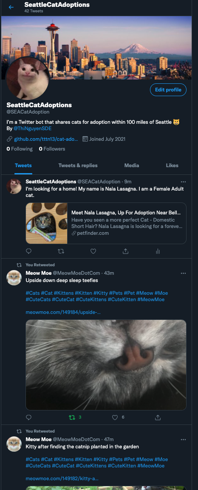

# Cat Adoption Twitter Bot
[Live Demo](https://twitter.com/SEACatAdoption)       

This bot is similar to the [Dog Adoption Twitter Bot](https://github.com/tttn13/dog-adoption-bot) that I made. Unlike the Dog Adoption Bot, this bot doesn't have the Like/Favorite functionality. It will share new cats and retweet every hour. 

This is a Twitter bot that shares new cats that are up for adoption every hour within 100 miles of Seattle Metro area. This bot will also search for the most 3 recent tweets that contain '#kitty #cat' and retweet them all. The bot will run every hour. 

    

Since this project is a copy <em>'cat'</em> of the [Dog Adoption Bot](https://twitter.com/SEACatAdoption) project (pun intended 😉 ) , if you wish to learn more about this project please visit the repo for the [Dog Adoption Twitter Bot](https://github.com/tttn13/dog-adoption-bot).

## Technologies 
- NodeJS
- Twitter API
- PetFinder API
- Heroku deployment
